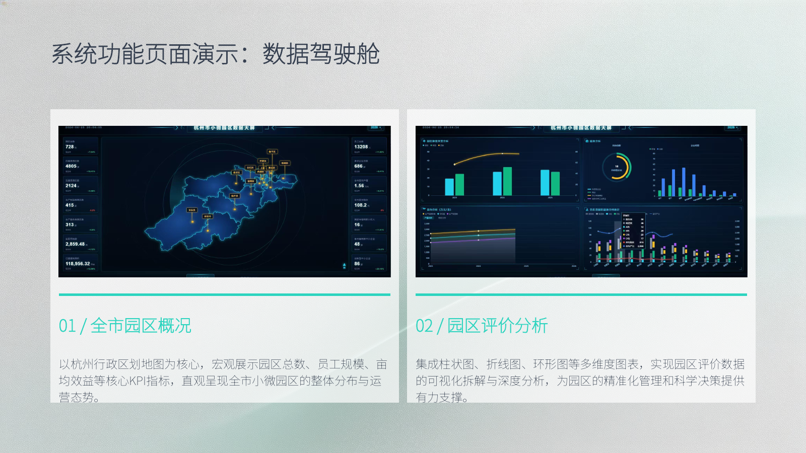
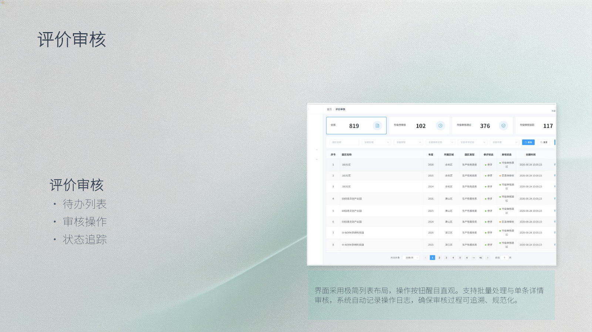
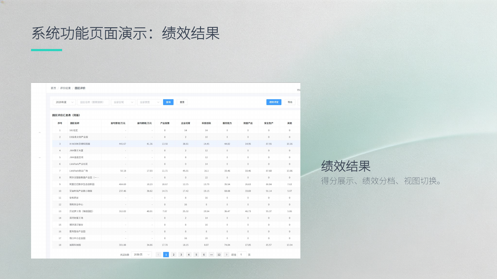

# 杭州市小微园区评价数据分析平台

面向小微园区年度评价场景的前后端分离管理系统，围绕园区数据采集、区县初审、市级终审、绩效分档和统计展示，提供市级、区县、园区三级角色协作流程。

> 本项目为计算机科学与技术专业课程团队项目，用于学习、答辩和技术交流，不代表杭州市相关部门的正式生产系统。仓库展示的是团队项目整体成果，不表示任一成员独立完成全部模块。

## 项目概览

传统园区评价存在材料分散、跨层级流转不便和统计口径难统一等问题。本项目将评价过程拆分为园区填报、区县审核与上报、市级审核和结果展示，并通过角色和数据范围限制不同用户能够访问的内容。

### 核心功能

- **三级角色与数据范围**：市级查看全市数据，区县查看本区县数据，园区查看本园区数据。
- **年度评价填报**：支持分模块填写评价信息、上传材料、保存草稿和提交审核。
- **分级审核流转**：支持区县初审、区县上报、市级终审、驳回修改和审核历史追踪。
- **评价结果管理**：汇总评价得分，展示 A/B/C/D 绩效分档，并支持列表查询与导出。
- **数据仓库与批量处理**：提供多类 Excel 模板的下载、导入、预览和结果查询。
- **数据驾驶舱**：通过 ECharts 展示园区概况、评价统计和相关指标。
- **系统设置**：管理市级、区县和园区账号，以及园区、企业等基础信息。

## 项目截图

### 数据驾驶舱



### 评价审核



### 绩效结果



## 核心业务流程

当前版本在区县审核通过与市级终审之间增加了“上报市级”步骤：

```text
园区保存草稿（0）
      │ 提交
      ▼
待区县审核（1）
      │ 区县通过
      ▼
区县审核通过（2）
      │ 区县上报
      ▼
已上报市级（5）
      ├──────── 市级通过 ────────> 通过（3）
      └──────── 市级驳回 ────────> 驳回（4）

区县审核也可驳回至状态（4）；驳回记录修改后可重新提交。
```

| 状态值 | 含义 | 主要可执行操作 |
|---:|---|---|
| 0 | 草稿 | 编辑、提交 |
| 1 | 待区县审核 | 区县通过或驳回 |
| 2 | 区县审核通过 | 区县上报市级 |
| 5 | 已上报市级 | 市级通过或驳回 |
| 3 | 通过 | 查看结果 |
| 4 | 驳回 | 修改并重新提交 |

评价审核不仅修改主记录状态，也会保存审核人、审核动作、意见和时间，供审核历史查询与页面展示。

## 角色与权限

| 角色 | `role_type` | 数据范围 | 主要功能 |
|---|---:|---|---|
| 市级管理员 | 1 | 全市 | 数据驾驶舱、园区与企业管理、市级终审、评价结果、系统设置 |
| 区县管理员 | 2 | 本区县 | 数据看板、园区与企业管理、区县初审、上报市级、评价结果 |
| 园区管理员 | 3 | 本园区 | 园区资料、入驻企业、年度评价填报、评价结果 |

前端路由通过角色信息控制菜单和页面入口；后端接口结合 `role_type`、`district_id` 和 `park_id` 校验数据范围。前端限制只用于改善交互，实际权限仍以后端校验为准。

## 技术栈

| 层级 | 技术 |
|---|---|
| 前端 | Vue 2.6、Vue Router 3、Vuex 3、Element UI 2.15、Axios、ECharts 5 |
| 后端 | Java 8、Spring Boot 2.7.18、MyBatis-Plus 3.5.5、JWT、Spring Validation |
| 数据处理 | Apache POI、EasyExcel、文件上传与预览 |
| 数据库 | MySQL 8.0、18 张业务表、逻辑删除与常用字段索引 |
| 接口文档 | springdoc-openapi-ui、Swagger Annotations |
| 构建工具 | Maven、Vue CLI 5、npm |

## 系统架构

```text
浏览器
  │
  │ HTTP / JSON
  ▼
Vue 2 + Element UI
  │ Axios / Bearer Token
  ▼
Spring Boot REST API
  ├── Controller：参数接收、权限入口、统一响应
  ├── Service：评价流转、审核记录、导入解析等业务逻辑
  ├── Mapper：MyBatis-Plus 数据访问
  └── Filter / Exception：JWT 校验与统一异常处理
  │
  ▼
MySQL 8.0
```

后端接口统一使用 `/api` 前缀，业务响应采用 `code`、`message`、`data`、`timestamp` 结构。评价、审核、园区、企业、系统设置和数据驾驶舱按业务模块组织。

## 目录结构

```text
Hangzhou/
├── park-admin/                    # Vue 2 前端
│   └── src/
│       ├── api/                   # 接口封装
│       ├── components/            # 公共组件
│       ├── router/                # 三级角色路由
│       ├── store/                 # Vuex 状态
│       ├── utils/                 # Axios 等公共工具
│       └── views/                 # admin / district / park 页面
├── park-server/                   # Spring Boot 后端
│   ├── src/main/java/com/park/
│   │   ├── auth/                  # 登录与 JWT
│   │   ├── audit/                 # 审核记录
│   │   ├── evaluation/            # 评价填报与状态流转
│   │   ├── park/                  # 园区管理
│   │   ├── enterprise/            # 企业管理
│   │   ├── dashboard/             # 统计接口
│   │   ├── system/                # 用户与数据仓库
│   │   └── common/                # 响应、异常、过滤器
│   ├── src/main/resources/
│   │   ├── application.yml
│   │   ├── application-dev.yml.example
│   │   └── templates/             # Excel 模板
│   └── sql/complete_schema.sql     # 完整建表与初始化脚本
├── docs/                           # 项目文档与演示资源
└── README.md
```

## 快速开始

### 1. 环境要求

- JDK 8 或更高版本
- Maven 3.6+
- Node.js 14+
- MySQL 8.0+

### 2. 初始化数据库

执行 [完整数据库脚本](park-server/sql/complete_schema.sql)。脚本会创建 `park_evaluation` 数据库、18 张业务表及课程演示所需的初始化数据。

### 3. 配置后端

复制配置示例：

```text
park-server/src/main/resources/application-dev.yml.example
```

将副本命名为 `application-dev.yml`，再填写本机数据库连接信息和 JWT 密钥。真实密码和密钥不要提交到 Git。

### 4. 启动后端

```bash
cd park-server
mvn spring-boot:run
```

后端默认地址：`http://localhost:8080`

接口文档：`http://localhost:8080/swagger-ui.html`

### 5. 启动前端

```bash
cd park-admin
npm install
npm run serve
```

前端默认地址：`http://localhost:8081`

### 6. 本地演示账号

| 角色 | 用户名 | 初始密码 |
|---|---|---|
| 市级管理员 | `admin` | `123456` |
| 区县管理员 | `district` | `123456` |
| 园区管理员 | `park` | `123456` |

这些账号和密码仅用于本地课程演示。部署到任何共享环境前，必须更换初始密码、数据库凭据和 JWT 密钥，并限制上传目录及跨域来源。

## 可重点查看的实现

- [评价状态流转与结果同步](park-server/src/main/java/com/park/evaluation/service/EvaluationService.java)
- [区县上报和市级终审接口](park-server/src/main/java/com/park/evaluation/controller/EvaluationController.java)
- [审核记录服务](park-server/src/main/java/com/park/audit/service/AuditService.java)
- [市级审核详情页](park-admin/src/views/admin/audit/detail.vue)
- [数据仓库导入服务](park-server/src/main/java/com/park/system/service/DataWarehouseService.java)
- [数据库结构](park-server/sql/complete_schema.sql)

## 当前边界

- 项目以课程演示和业务流程验证为目标，尚未进行生产环境上线验证。
- 文档中的并发量、响应时间等需求指标不作为已完成的性能测试结果。
- 仓库包含课程演示数据；使用真实数据前应补充脱敏、备份、权限审计和安全测试。
- 当前自动化测试覆盖有限，功能正确性仍需要结合接口测试和页面流程验证。

## 版本说明

- `2026-06-11`：默认分支早期版本，包含基础三级角色和评价审核流程。
- `2026-06-27`：完善园区端评价、区县审核与上报、市级终审记录、驳回后重新提交、数据驾驶舱和数据仓库等功能。
- `2026-09-06`：同步当前版本到默认分支，更新项目定位、业务流程、截图和运行说明。
